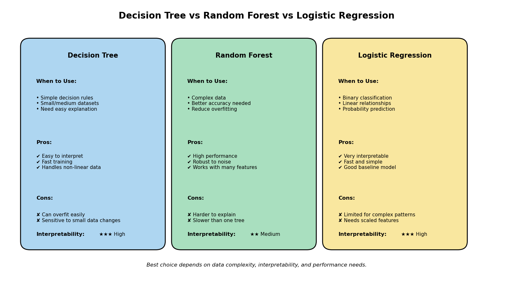

## Prompt:-

Generate a Python matplotlib infographic comparing Decision Tree, Random Forest, and Logistic Regression side by side for a non-technical audience. Show for each model: when to use it, pros, cons, and interpretability level (High/Medium/Low using stars or bars). Use 3 clean columns, colored boxes, clear labels, and infographic-style design, with title "Decision Tree vs Random Forest vs Logistic Regression". Add a footer: "Best choice depends on data complexity, interpretability, and performance needs." Output should be fully runnable Python code with plt.show()

## AI - Generated Output:-

### [`ChatGPT Response`](https://chatgpt.com/s/t_69cdf20b2c8c81918f7abfe0f2454c3e)

## Test File :-

### [`infographic.ipynb`](./infographic.ipynb)

## Output :-

## Evaluation:-

### Is the visualization accurate?
Yes, the visualization is generally accurate for a non-technical audience because it correctly highlights the main strengths and weaknesses of each model.

### Does it oversimplify?
Yes, it oversimplifies because Logistic Regression does not always perform well unless data follows a roughly linear pattern, and Random Forest is not always the best choice for every complex dataset.

### Improve with your own corrections
A better version should mention that Decision Trees can become unstable with small data changes, Random Forest reduces this instability by combining many trees, and Logistic Regression works best when relationships between features and target are approximately linear.

