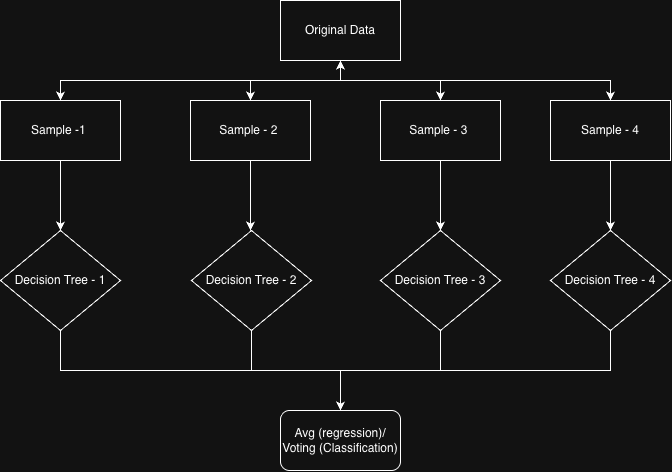

## Q1: Bias-Variance Tradeoff

Bias variance tradeoff explains the balance between underfitting and overfitting in machine learning.

 - Bias is error caused by overly simple assumptions.
 - Variance is error caused by sensitivity to training data.

### Decision Tree 

A deep Decision Tree has:

- low bias
- high variance

because it learns training data very closely and may overfit.

### Random Forest 

A Random Forest reduces variance because:

- many trees are trained on different bootstrap samples
- predictions are averaged

This makes the model more stable.

### Why bagging reduces variance

Bagging creates multiple trees:


<br/>




<br/>


Bagging reduces variance by creating multiple Decision Trees that are trained on different bootstrap samples of the training data. The predictions of these trees are then averaged to get the final prediction. This averaging reduces the impact of any one tree's predictions on the final result, making the model more stable.

### Formula


The variance of the predictions of a Random Forest is given by:

variance = (sum of (variance of each tree)) / (number of trees)

The variance of each tree is reduced because each tree is trained on a different bootstrap sample of the training data. This reduces the overall variance of the model.

## Q2: Coding — Overfitting Curve

### Code:- 

```python
import matplotlib.pyplot as plt
from sklearn.model_selection import train_test_split
from sklearn.tree import DecisionTreeClassifier
from sklearn.metrics import accuracy_score

def plot_overfitting_curve(X, y, max_depths):

    X_train, X_test, y_train, y_test = train_test_split(
        X, y, test_size=0.2, random_state=42
    )

    train_acc = []
    test_acc = []

    for depth in max_depths:

        model = DecisionTreeClassifier(
            max_depth=depth,
            random_state=42
        )

        model.fit(X_train, y_train)

        train_pred = model.predict(X_train)
        test_pred = model.predict(X_test)

        train_acc.append(
            accuracy_score(y_train, train_pred)
        )

        test_acc.append(
            accuracy_score(y_test, test_pred)
        )

    plt.figure(figsize=(8,6))
    plt.plot(max_depths, train_acc, label='Train Accuracy')
    plt.plot(max_depths, test_acc, label='Test Accuracy')

    plt.xlabel('Max Depth')
    plt.ylabel('Accuracy')
    plt.title('Overfitting Curve')
    plt.legend()
    plt.show()

    optimal_depth = max_depths[test_acc.index(max(test_acc))]
    print("Optimal Depth:", optimal_depth)
```

### Interpretation

Optimal depth is where test accuracy is maximum before it starts decreasing.


## Q3: Debug — Same Train and Test Accuracy (0.95)

### If train accuracy = test accuracy = 0.95:

If train accuracy equals test accuracy, it can be a good sign that the model generalizes well and there is no overfitting. However, it can also be a sign of a too simple dataset, data leakage, or duplicate records. To verify, always check that the train-test split is done correctly, there is no leakage during preprocessing, and no duplicated samples exist.

